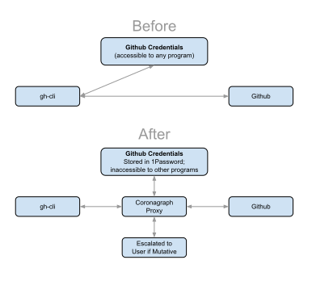
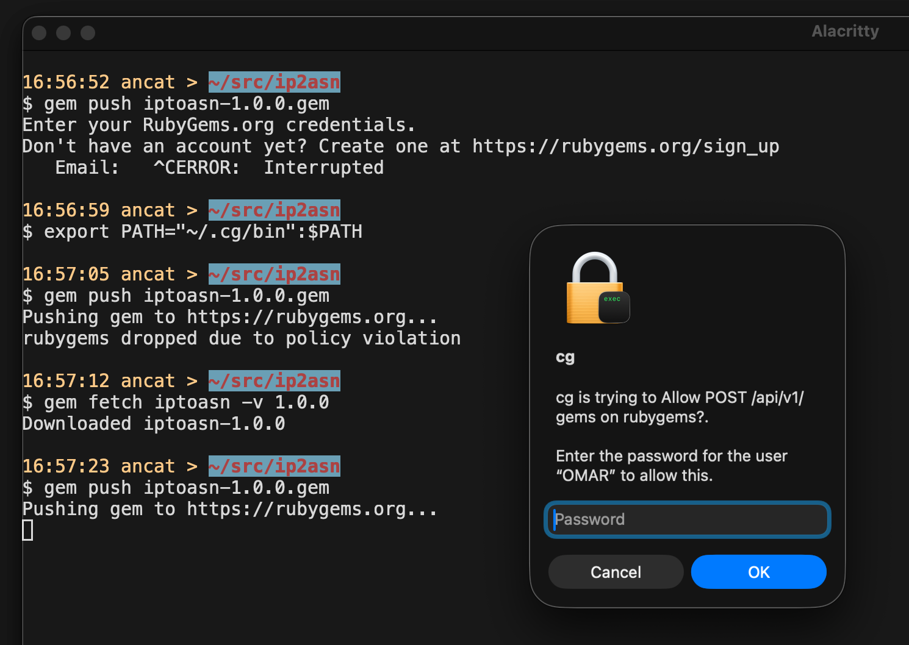

# Coronagraph

In a local development environment, it’s not uncommon to have API credentials littered around your filesystem. You create them once and never think about them again, not even when you use them. The user experience is pretty seamless, but this comes with some pretty sharp edges: these credentials are exposed to every library, IDE extension, and piece of software that you install. Time and time again we’ve seen malware distributed via supply chain attacks whose sole purpose is to steal these developer credentials so they can be used to launch subsequent attacks.

Coronagraph aims to mitigate these risks by providing a safer way to access and use these credentials. Its main interface is an authenticating proxy. Instead of your developer tools (Github CLI, PyPI, Rubygems, npm, etc) authenticating to remote services using credentials that live in plaintext on disk, they can connect to Coronagraph which will dynamically insert these credentials into outbound HTTP requests. The end result is that your requests are authenticated to the upstream services without clients ever handling any credentials.



One of Coronagraph’s design principles is to be as quiet as possible. One way it does this is by distinguishing between read-only and read-write API calls. If a request is determined to be read-only, it will be allowed to pass through transparently; if on the other hand it is determined to be read-write, it will escalate to the user via TouchID, just like sudo would. This way for example, you can have one Rubygems API key, but only be notified (and optionally block) when pushing or deleting a package.



## Goals

More explicitly, Coronagraph’s primary goals are to mitigate three major risks that come with plaintext handling of credentials:
* **Credential theft**: e.g. via malware that looks for credentials on disk and sends them to a remote attacker; whether you use 1password or the built in local vault, there are no credentials on disk to steal.
* **Credential abuse/misuse**: e.g. via malware that after achieving code execution uses the credentials from the affected system; while some payloads will attempt to use any credentials on the spot, Coronagraph will prompt for any mutative requests, mitigating unintended releases or other potentially destructive changes
* **Accidental disclosure**: e.g. accidentally pushing files containing credentials to git; similarly to the credential theft scenario, keeping credentials off disk minimizes the likelihood of accidental disclosure

## Setup

### Certificates

Because Coronagraph inserts credentials into HTTP requests, it needs to be able to terminate TLS. To do that, we'll use mkcert. I do not recommend you install these certificates to your system store.

```
mkcert
```

### Credentials

After setting up your certificate, you will need to configure your credentials. Coronagraph comes with `local-vault`, a DotEnv formatted file encrypted at-rest with a passphrase. You can set it up with the `local-keys` command. Init will prompt you for a passphrase that you will need to include with any subsequent decryptions.

```
cg local-keys init
cg local-keys edit
```

Alternatively, if you have 1password with the op cli installed, you can create a Secure Note with your secrets also in DotEnv format. You will just need to point your config file at the note.

Right now, coronagraph supports Rubygems (gem and bundler) and Github. Set the appropriate values in your secret store and coronagraph will pull them in.


| Tool             | Secret name        | Example                       |
| ---------------- | ------------------ | ----------------------------- |
| `bundle` / `gem` | `GEM_HOST_API_KEY` | `rubygems_...`                |
| `gh`             | `GH_TOKEN`         | `gho_...` or `github_pat_...` |

After setting up your credentials, you can configure Coronagraph:

```yaml
coronagraph:
  port: 11111
  credentials: local-vault
  tls:
    certificate: /Users/omar/certs/rootCA.pem
    key: /Users/omar/certs/rootCA-key.pem

```

Or if you’re using 1Password:

```yaml
coronagraph:
  port: 11111
  credentials: 1password
  op_secret_ref: op://Developer Creds/g4pixtjpdnd7btevhwf74pgw2u/notesPlain
  tls:
    certificate: /Users/omar/certs/rootCA.pem
    key: /Users/omar/certs/rootCA-key.pem
```

### Shims

Once Coronagraph has your credentials, you need to instruct other programs to use it. First, start the proxy:

```
cg serve
```

You will be asked to enter your passphrase for local-vault or to unlock 1Password. At this point, you can point any HTTP client at this proxy. For built in supported programs, run the following commands:

```
cg generate bundles
cg generate shims
export PATH="~/.cg/bin":$PATH
```

The `bundles` command will generate the CA bundles needed by various programs to connect to the proxy. The `shims` command will generate shims for supported programs that transparently force it to use the proxy with the various CA bundles automatically configured for you. Any subsequent invocations of `gh`, `gems`, etc should behave as normal.
